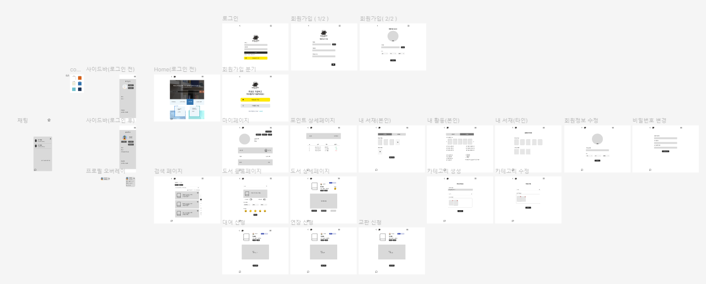
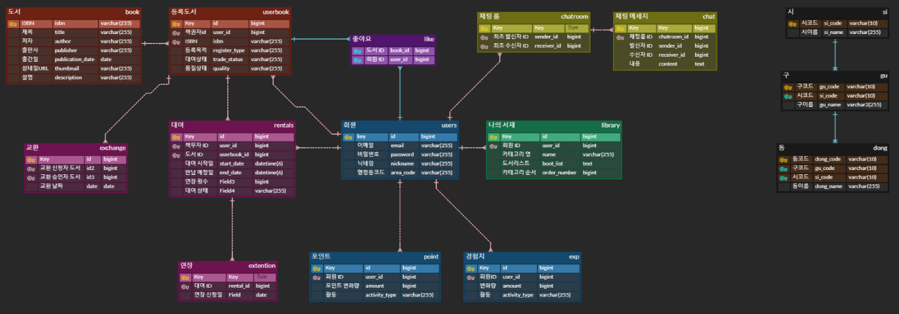
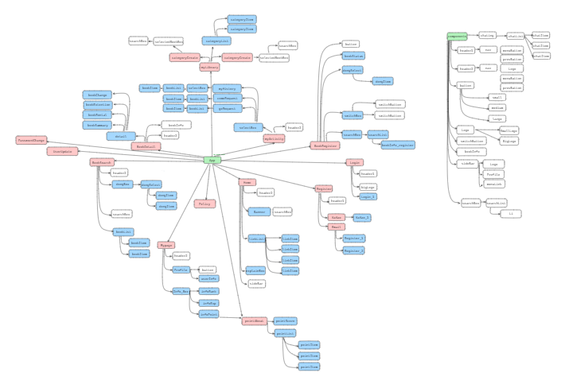

## 💻 개요
- 진행기간 : 2024. 07.02 ~ 2024.08.16 (7주)
- 서비스명 : 우주도서(Galaxy Book)
- 서비스 소개 : 주변에서 필요한 책을 대여하고 교환할 수 있는 P2P 플랫폼

 

## 💡 기획 배경
### 1. 문제점
- 도서관 분포의 불균형
- 도서관 운영시간 제한
- 신간 평균 정가의 상승

### 2. 기획의도
주변에 도서관이 없는 도서 취약 계층, 도서 구매에 금전적인 어려움이 있는 사람들을 위해 동네 커뮤니티를 형성하여 도서 접근성을 높이고자 함

### 3. 기대효과
- 도서 접근성 향상 : 도서관이 없는 지역 주민들이 편하게 원하는 책 접근 가능
- 시간 제한 없이 이용 가능 : 사용자간 합의에 의해 시간 조정 가능
- 도서 정보 공유 및 소통 : 도서에 대한 정보 & 독서 경험을 공유할 수 있는 소통의 장
- 잉여 책의 활용도 증대 : 읽지 않는 책을 대여, 교환함으로써 자원의 효율적 활용 도모

 

## 🗂️ 주요 기능
### 1. 도서 등록
다른 사람과 교환하고 싶은 책, 자리만 차지하고 있는 잉여 책을 등록하고 관리
### 2. 도서 검색 및 거래
대여 또는 교환하고 싶은 책을 나의 주변 또는 원하는 동네로 검색하고 거래(대여 또는 교환)
### 3. 실시간 채팅
실시간 채팅을 통해 대여 및 교환 시간과 장소를 정하고 자유롭게 거래
### 4. 도서 큐레이팅(나의 서재)
본인을 나타낼 수 있는 도서를 카테고리별로 묶어 다른 이용자에게 소개

 

## 📚 프로젝트 산출물
### 1. 와이어프레임(Figma)

### 2. ERD

### 3. 컴포넌트 구조

 

## 🏷️ 기술 스택 및 개발 환경
#### Language

#### Framework

#### DB

#### Dev

#### Tools

#### Protocol

#### Message Broker

#### Environment

#### etc

 

## 👨‍👧‍👧 팀원 소개
| 이름 | 역할 |
|--|--|
| 권대호 | 백엔드 |
| 송재원 | 백엔드 인프라 |
| 이유찬 | 팀장 프론트엔드 |
| 이준혁 | 백엔드 |
| 최지우 | 프론트엔드 인프라 |
| 허유정 | 백엔드 프론트엔드 |